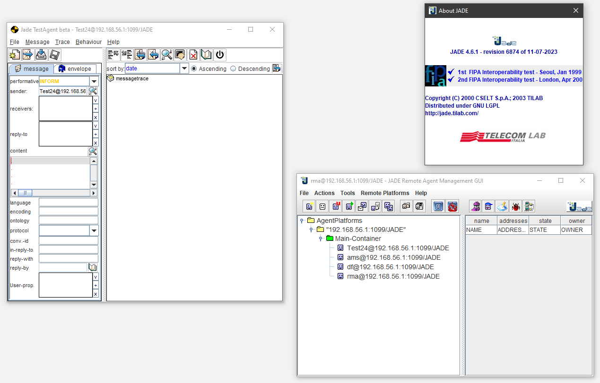

# JADE JAVA Agent DEvelopment Framework 4.6.1

> JADE version 4.6.1 - revision 6874 compiled with OpenJDK-17LTS and Maven or with Docker Java image.


## Rev.6874 (11 de julio de 2023)

> Revision: 6874<br>
  Author: Enrico Scagliotti and Giovanni Caire<br>
  Date: martes, 11 de julio de 2023 14:59:35<br>
  Message: Retectored AgentMobilityService to permit overloading of fetchClassFile method

----

> Modified : /trunk/build.properties<br>
  Modified : /trunk/src/jade/core/mobility/AgentMobilityService.java<br>
  From     : https://jade.tilab.com/svn/jade/trunk<br>
  Changelog: https://jade.tilab.com/doc/ChangeLog<br>


### Local build process with Maven and OpenJDK-17:

> On the local machine: when Maven and Java JDK-17LTS have been configured.


```shell
  git clone https://github.com/dpsframework/JADE-FIPA-4.6.1.git
  cd JADE-FIPA-4.6.1
  mvn package
  
  
Testing: 

  cd target
  java -jar jade-4.6.1-6874.jar -gui -agents Test24:jade.tools.testagent.TestAgent
  
```

### Docker build process with Maven an OpenJDK-17 image:

> Through an official Maven-OpenJDK-17 imagen using docker with the following instruction.

You can run a Maven project by using the Maven Docker image directly, passing a Maven command to docker run:

```
git clone https://github.com/dpsframework/JADE-FIPA-4.6.1.git
cd JADE-FIPA-4.6.1

(As proposed in: https://hub.docker.com/_/maven)

docker run -it --rm --name jadeBuilder -v "$(pwd)":/usr/src/jade -w /usr/src/jade maven:3.8.3-openjdk-17  mvn package


Testing: 

  cd target
  java -jar jade-4.6.1-6874.jar 


```

### Docker build process with Maven an OpenJDK-8 image:

> Through an official Maven-OpenJDK-8 image.

```
git clone https://github.com/dpsframework/JADE-FIPA-4.6.1.git
cd JADE-FIPA-4.6.1


docker run -it --rm --name jadeJDK8 -v "$(pwd)":/usr/src/jade -w /usr/src/jade maven:3.3-jdk-8 mvn -f pom8.xml package

Testing: 

  cd target
  java -jar jade-4.6.1-6874.jar 

```




