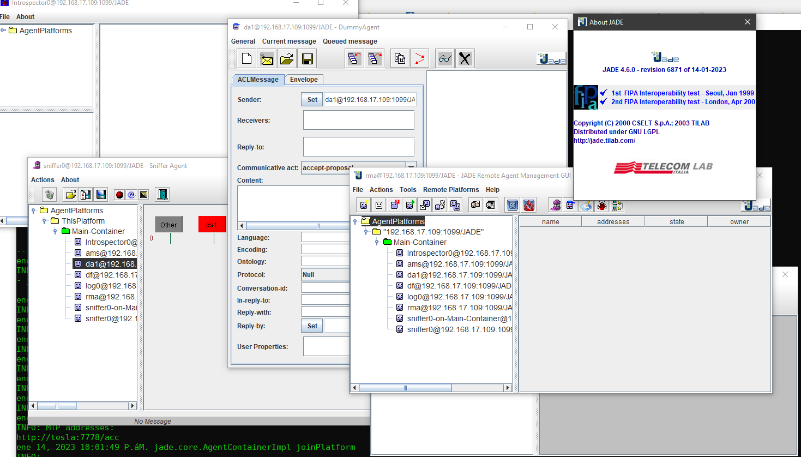

# p21-JADE-FIPA-4.6.0

## 1. Compiling proposal: p21-JADE-FIPA-4.6.0 (COMPLETED)


### 1.1. How to generate: `jade-4.6.0-6871.jar` with Maven

- From the console, once Apache-Maven is correctly installed:

```shell
git clone https://github.com/dpsframework/p21-jade-fipa-4.6.0.git
cd p21-jade-fipa-4.6.0

mvn package
```

- In directory: `./target/`, the file `jade-4.6.0-6871.jar` is the full version of the JADE Platform that can operate autonomously until the future revision of JADE.


- **Check the result again with:**:


```shell 
 cd target
 
 java -jar jade-4.6.0-6871.jar -gui
```


**Fig. 1**: 




